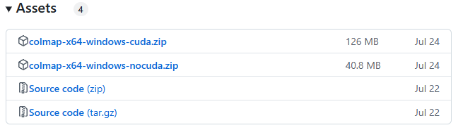
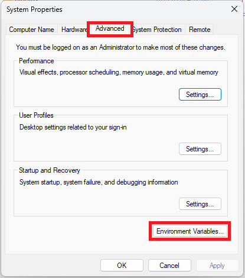
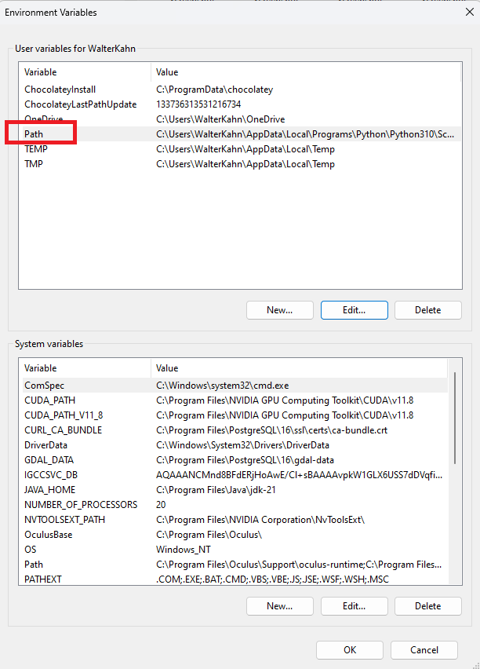
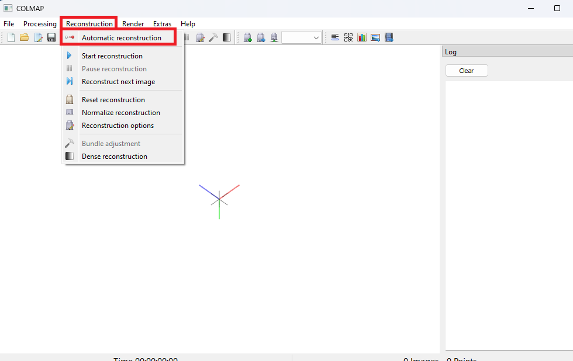
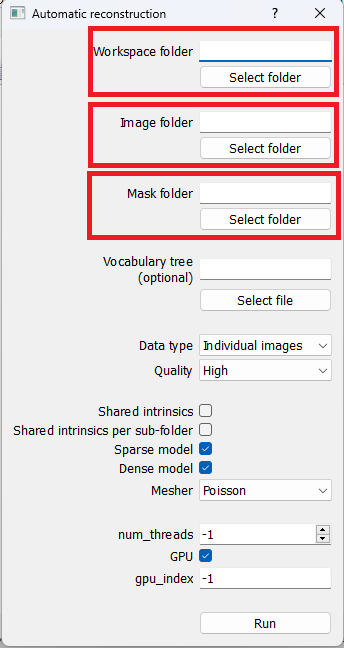

# COLMAP setup
<!-- Qiaorui Yang, Shawn Tew, Xiaduo Zhao, Walter Kahn, Marieke van Arnhem -->

## Abstract
COLMAP is a Structure from Motion sparse point cloud Image extracter. That is required for a variety of Gaussian splatting applications. A more detailed description of COLMAP is provided here https://colmap.github.io/.

### Hardware Requirements
- Nvidea Graphics card with Cuda

### Software Requirements
- A 11.x installation of CUDA

## Installation
The first step of installing COLMAP is to retrieve the latest binary from https://github.com/colmap/colmap/releases. We used version 3.10 but since the output format does not change later versions can be picked aswell.

Pick colmap-x64-windows-cuda.zip and download the folder. The Cuda accelarated will be quicker and is required for later steps.

Once the file has been downloaded the zipper folder can be moved to a desired place on the computer. Once it has been moved the folder can be extracted. 

Opening the extracted folder and clicking on COLMAP.bat will start the GUI of COLMAP. For certain Gaussian splatting methods COLMAP also needs to be placed as a global variable.

For this search "Edit the system environment variables" in the windows search bar. Open the settings and go to the "Advanced" ribbon tab. From here a button called Environment Variables should be clicked. 

From here a the "User variables" can be edited. Click on the "Path" variable this should open another window. 

Copy the location where the COLMAP folder was extracted and copy the path and go back to the "Edit Environment variable" for Path and paste the path into one of the empty lines.

Now COLMAP is installed on your computer and the computer is also able to find it's path. For safe measure it is recommended to restart the computer to allow for the paths to be reset.

## Steps

Now that COLMAP is installed the program can be used for sparse pointcloud extraction from a set of flat image plane images. This is only required for programms that require COLMAP but do not call COLMAP from the command line.

As stated before COLMAP can be started by clicking on the COLMAP.bat in the extracted folder or throught the windows search option. 

This opens both a terminal and the GUI. For now only the GUI needs to be used. By clicking on "reconstruction" and "Automatic reconstruction" The process can be started. 

For the final step three path/ locations need to be. The "Workspace" and "Mask" folder are the output folders and the "Image" folder is the place were the images are stored. Then the user can click on RUN to start the COLMAP process.

[site](https://github.com/ShawnTew/Synthesis-Project-Group-4)

