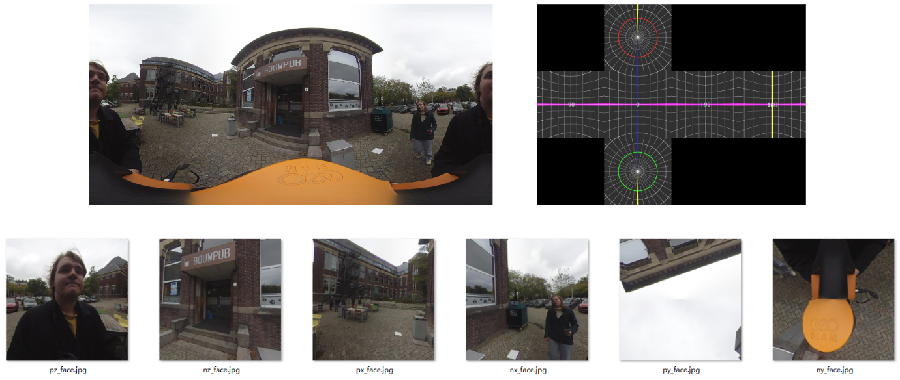

# CubeMap Setup
<!-- Qiaorui Yang, Shawn Tew, Xiaduo Zhao, Walter Kahn, Marieke van Arnhem -->


## Abstract
The images from the GeoSLAM or any other 360 degree camera will either be output as two fish eye lens images or as a panoramic image. Both COLMAP and Gaussian splatting software require flat image planes for sparse SfM pointcloud reconstruction. The implemented method is based on https://jaxry.github.io/panorama-to-cubemap/ which allows the user to convert images online as well.

### Files
Two folders need to be created or need to exist. The first containing the source images and a second folder that will store the output.

## Installation

Set up a Python environment or use an already existing one.

```bash
conda create -n myenv python=3.12
conda activate myenv
```

Install the following packages

```bash
pip install numpy
pip install scipy
pip install pillow
```

## Steps

Change the path for both the source and the output folder in the code.

```python
if __name__ == '__main__':
    source_dir = './source_images'  # Path to source images
    target_dir = './cubemap_output'  # Path to save output images
    process_directory(source_dir, target_dir)

```

[site](https://github.com/ShawnTew/Synthesis-Project-Group-4)

