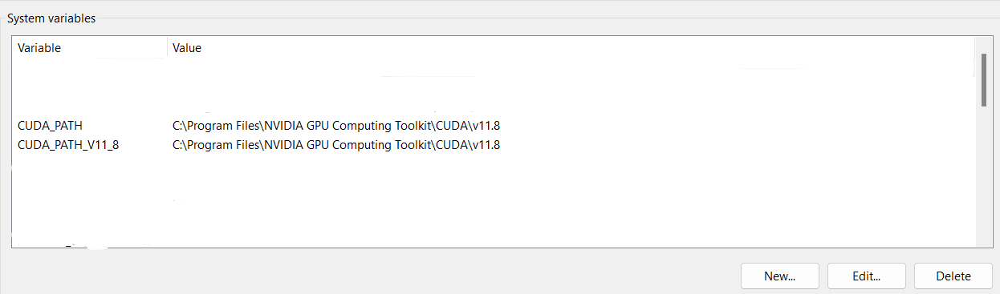
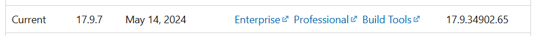
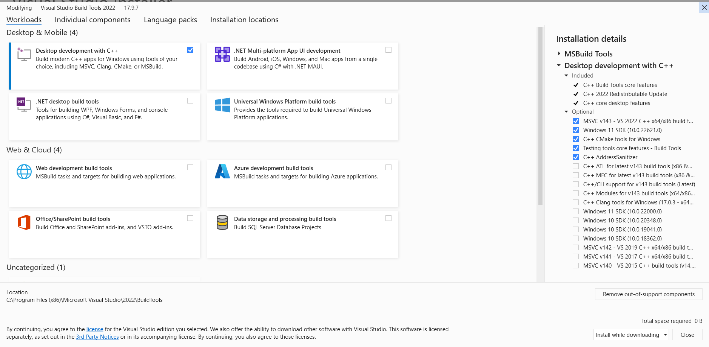

# Using LOD-3DGS
<!-- Qiaorui Yang, Shawn Tew, Xiaduo Zhao, Walter Kahn, Marieke van Arnhem -->

## Abstract
This setup is based on **https://github.com/zhaofuq/LOD-3DGS/tree/main**. Please check those requirements. Below you can find comments on some requirements that worked for us in a specific way. Besides that, it shows how we got the input files to let it work,

### Software Requirements
- CUDA
  - For us 11.8 worked. Do not install a 12.X version.
  - Search in your laptop for *Edit the System environment variables*. Click on *Environment Variables* and make sure your path to your cuda is defined in *System Variables*. See below.
  

- Set your paths. Search in your laptop for *Edit the System environment variables*. Click on *Environment Variables*. In *System variables* click on the *Path* variable and make sure the following paths are defined there:
  - *C:\Program Files\NVIDIA GPU Computing Toolkit\CUDA\v11.x\bin*
  - *C:\Program Files\NVIDIA GPU Computing Toolkit\CUDA\v11.x\libnvvp*
  - *C:\Program Files\NVIDIA GPU Computing Toolkit\CUDA\v11.x\extras\visual_studio_integration\MSBuildExtensions*
  - *C:\Users\user_name\COLMAP-3.x-windows-cuda*
- Microsoft Visual Studio. 
  - Do not download VS2022 17.10, but 17.9x. You can find this version on **https://learn.microsoft.com/en-us/visualstudio/releases/2022/release-history#visual-studio-2022-version-179**. For example download the following Building Tools:
  
  - When installed, in Visual Studio Installer, make sure Desktop development with C++ is on. 
  
  - Go to the directory *C:\Program Files\NVIDIA GPU Computing Toolkit\CUDA\v11.x\extras\visual_studio_integration\MSBuildExtensions* copy all four files from this folder and paste to *C:\Program Files (x86)\Microsoft Visual Studio\2022\BuildTools\MSBuild\Microsoft\VC\v160* you just need to copy all the four files from *C:\Program Files\NVIDIA GPU Computing Toolkit\CUDA\v11.7\extras\visual_studio_integration\MSBuildExtensions*
    - The paths can be different for you.

### Files
- Run COLMAP on your images, so you can generate a *cameras.txt* file. Put the file *cameras.txt* into *7.Results/COLMAP/cameras.txt*.
- Make sure there is a folder in *1. Data* named *geoslam*. In this folder make sure you have the following files:
  - *traj.txt*: which represents the trajectory path of the geoslam. Which has the following columns: //world_time, x, y, z, q0, q1, q2, q3, r, g, b, nx, ny, nz, roll, pitch, yaw.
  - *orbit_import_camera.csv*: which has information per panoramic image. It has the following columns: Id, Image, Time, X, Y, Z, Heading, Roll, Pitch, Camera, Quality, Line, Color, AccuracyXyz
  - A folder named *cube map images* which contains all cube mapped images of the panoramic images that you want to use. Make sure the images are named as [name panoramic view]_X where X is B (back image), F (front), R (right), L (left), T or U (top or up), D (down).


## Installation
On the Github it was mentioned to create a new environment based on the *environment.yml* file. We installed all dependecies ourselves since we had for example a different CUDA version.
- When installing PyTorch, please check [the following site](https://pytorch.org/get-started/locally/) to check which version you must install so it is compatible with your CUDA version.

## Steps
1. Follow all the steps of the [lod-3dgs github](https://github.com/zhaofuq/LOD-3DGS/tree/main).
2. Make sure the Files are all correct set. 
3. Make sure for running the py files, to install [pandas](https://pandas.pydata.org/docs/getting_started/install.html) and [numpy](https://numpy.org/install/). 
4. Run the code in *generate cameras-txt file.py*. This creates a *cameras.txt* file in the folder *Generated Input*.
4. Make sure everything is set up correctly in *generate images-txt file.py*:
   - This code assumes the q0, q1, q2 and q3 values (from *traj.txt*) are the vaues applicable to the down image. If that is ont the case for you, change the function *get_view_quaternion* in the class *Quaternion*.
5. Run the code in *generate images-txt file.py*. This creates a *images.txt* file in the folder *Generated Input*.
6. Have a *data* folder in your cloned LOD-3DGS folder. 
   - In this folder make an *images* folder that contains all cubemapped images.
   - In this folder make a *sparse* folder. In there make a folder named *0*. In this folder:
      - Copy the created *cameras.txt* and *images.txt* files of *Generated Input* in the *data* folder.
      - Copy the generated .ply file by your LiDAR scanner. Name it *points3D.ply*. 
7. Open the command line tool and activate the created lod-3dgs environment. Go to the path where the cloned LOD-3DGS is located. Run the following
```bash
python train.py -s "./data" --use_lod --sh_degree 2 --densification_interval 10000 --iterations 100000 --scaling_lr 0.0015 --position_lr_init 0.000016 --opacity_reset_interval 300000 --densify_until_iter 200000 --data_device cpu -r 1
```
  This creates two folder in your data folder. One of them is *3D-Gaussian-Splatting* which saves the generated Gaussian splats in a folder *point_cloud*.
8. Render the environment by running the following line in CMD. Make sure [folder_name] is replaced with your folder name.
```bash
python render.py -m "./data_bouwpub_first/3D-Gaussian-Splatting/[folder_name]*
```
  This will take pictures at the same position where the initial photos were taken. The rendered images are visible in *data\3D-Gaussian-Splatting\[folder_name]\test*.