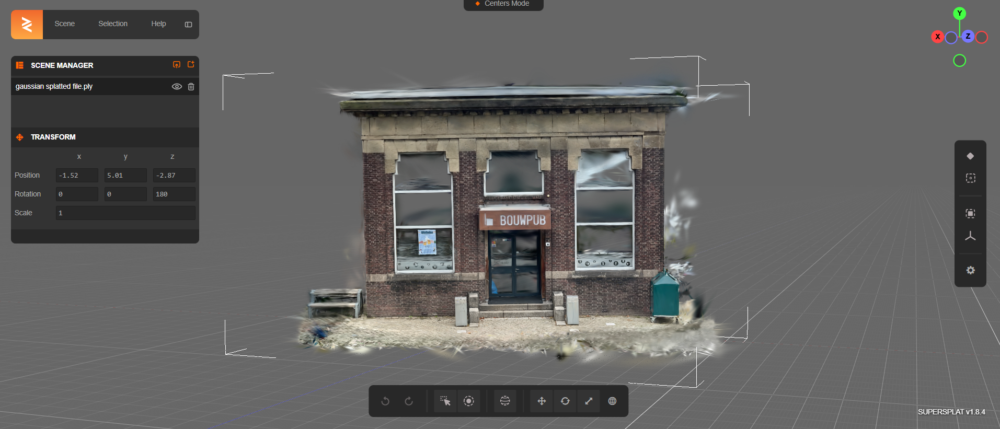

# Visualising in Supersplat
<!-- Qiaorui Yang, Shawn Tew, Xiaduo Zhao, Walter Kahn, Marieke van Arnhem -->

## Abstract
[SuperSplat](https://playcanvas.com/supersplat/editor) is a platform where it is possible to edit and show Gaussian splatted files. The rendering is done very well and fast, the splats look very real. Some outputs (for example from LOD-3DGS) were visible in SuperSplat and not in Blender for example.

